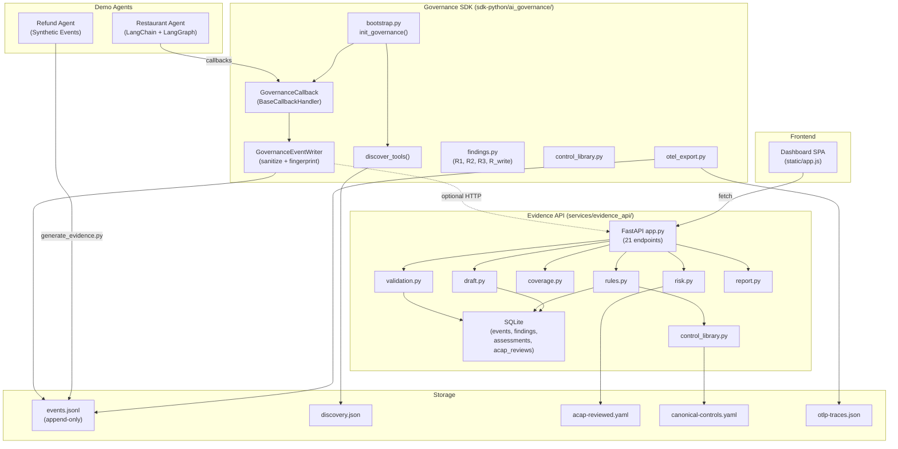
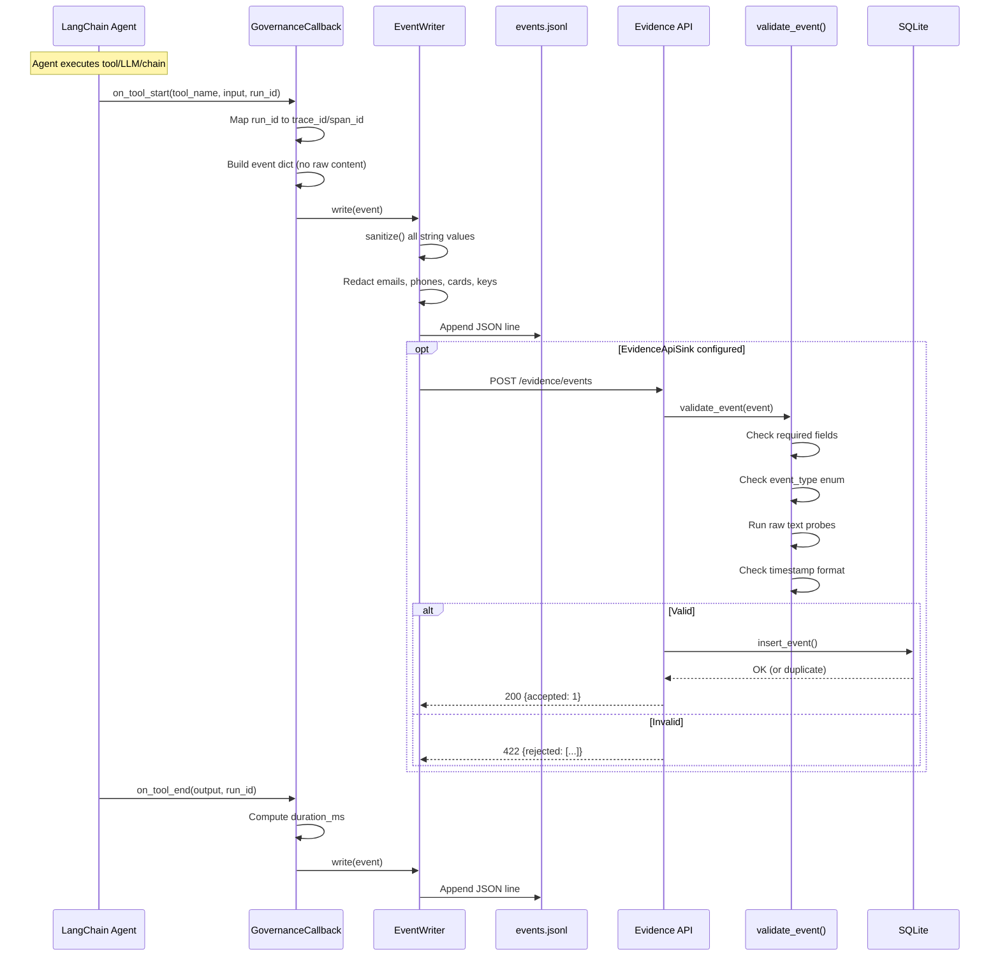
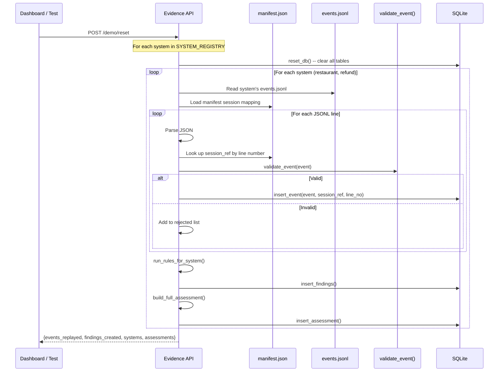
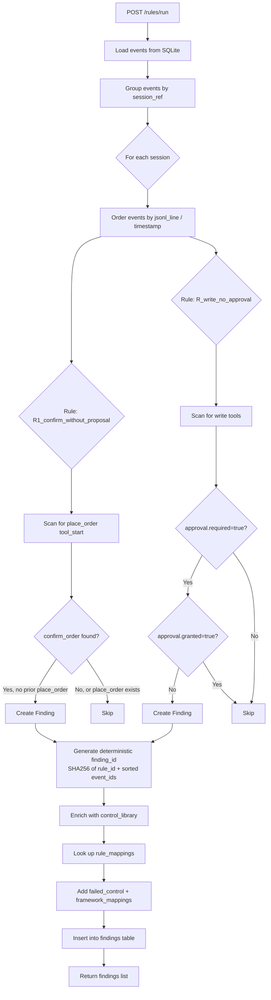
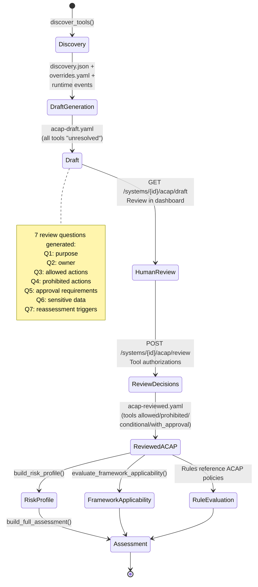
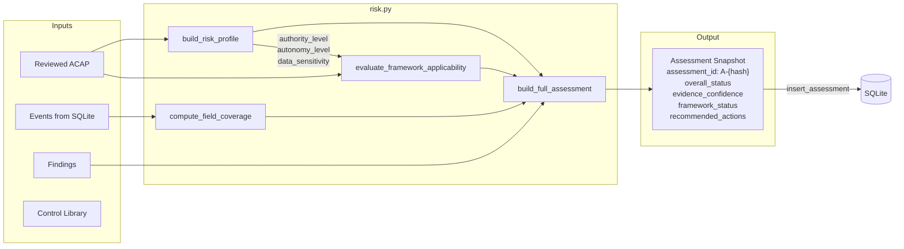
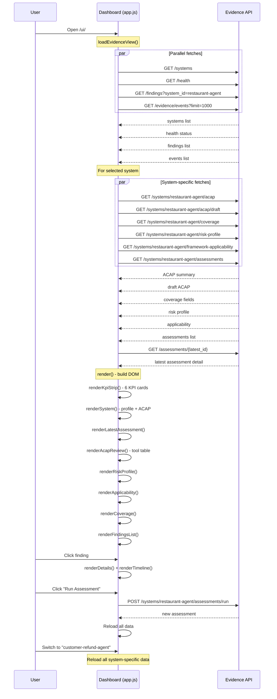
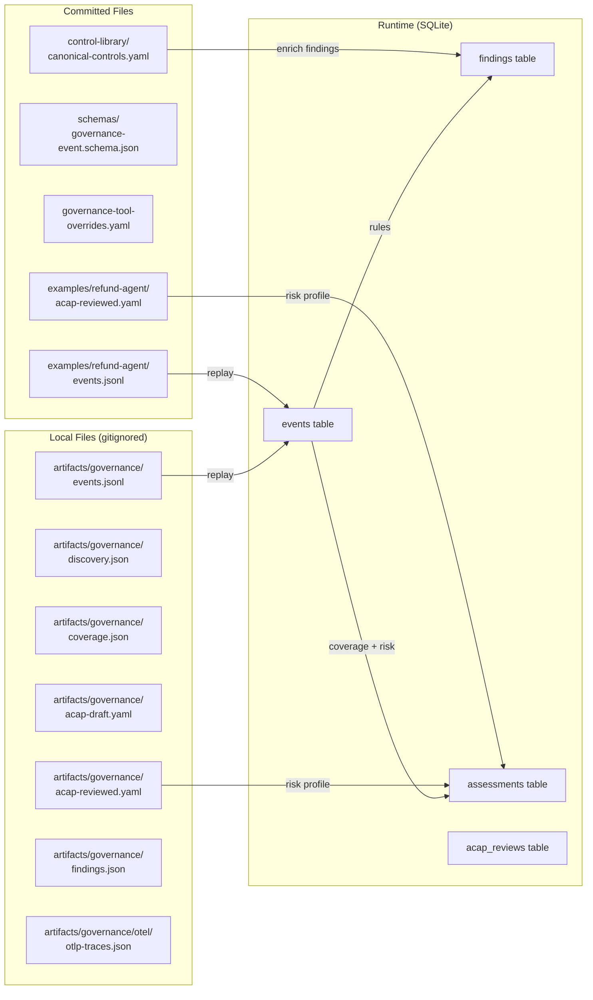
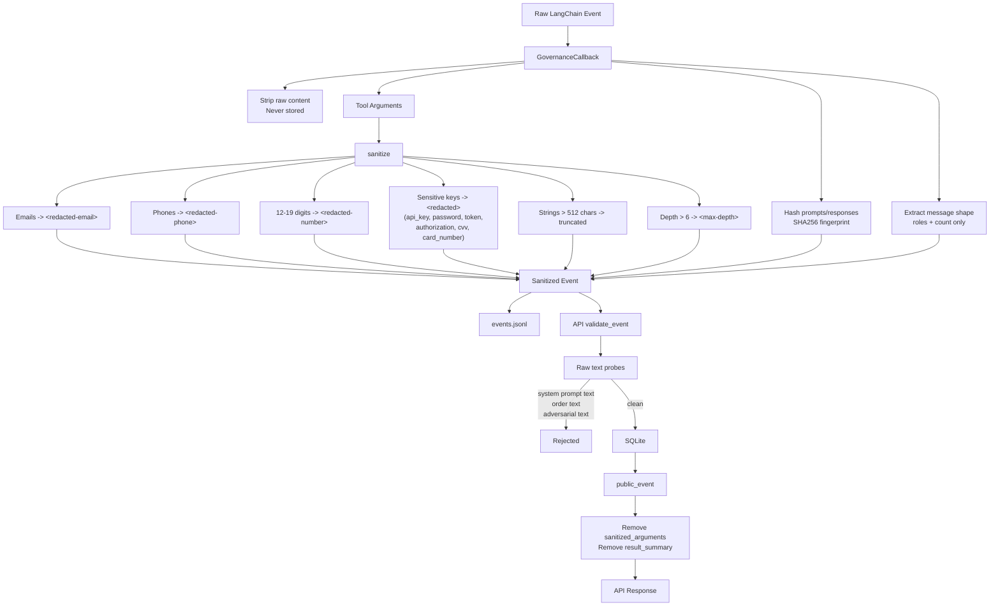

# Architecture Graphs

Mermaid diagrams for the AI Governance Command Center prototype.

---

## 1. System Architecture Overview

---

## 2. Evidence Ingestion Flow

---

## 3. JSONL Replay Flow (Demo Setup)

---

## 4. Rules Engine and Finding Flow

---

## 5. ACAP Lifecycle

---

## 6. Assessment Build Flow

---

## 7. Frontend / Backend API Flow

---

## 8. Data Storage Map

---

## 9. Privacy & Sanitization Pipeline

