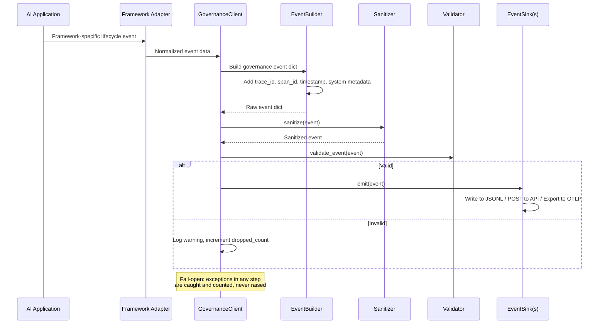

# Generic SDK Architecture

## Overview

The SDK is structured in concentric layers. The innermost layer (Core) has zero framework dependencies. Each outer layer adds optional capabilities. A developer only imports what they need.

```
┌─────────────────────────────────────────────────────┐
│                    Adapters                          │
│  (LangChain, OpenAI, Anthropic, LlamaIndex, etc.)   │
├─────────────────────────────────────────────────────┤
│                    Discovery                         │
│  (Tool introspection, model detection, ACAP draft)   │
├─────────────────────────────────────────────────────┤
│                     Sinks                            │
│  (JSONL, HTTP API, OTLP, Batch Queue)                │
├─────────────────────────────────────────────────────┤
│                     Core                             │
│  (EventBuilder, SessionTracker, Sanitizer,           │
│   Fingerprinter, Validator, Privacy)                 │
└─────────────────────────────────────────────────────┘
```

---

## Layer 1: Core

### Package: `ai_governance.core`

Zero external dependencies beyond Python stdlib + PyYAML. This is the heart of the SDK.

#### EventBuilder

Constructs governance events from raw inputs. Framework-agnostic.

```python
from ai_governance.core import EventBuilder

builder = EventBuilder(
    system_id="my-agent",
    deployment_id="prod-eu",
    environment="production",
    agent_id="support-bot-v2",
)

# Create any event type
event = builder.tool_start(
    tool_name="search_database",
    action_type="read",
    arguments={"query": "user 12345"},
    trace_id=trace_id,
    span_id=span_id,
)
# Returns a validated dict conforming to governance-event.schema.json v0.1
```

**Source mapping:** The event construction logic currently lives inside `GovernanceCallback._emit()` (`callback.py:147-188`). This needs extraction into a standalone class.

#### SessionTracker

Manages trace/span hierarchy and session boundaries. Thread-safe.

```python
from ai_governance.core import SessionTracker

tracker = SessionTracker()

# Start a new trace
trace_id = tracker.start_trace(session_id="conv-123")

# Create child spans
span_id = tracker.start_span(trace_id, parent_span_id=None)
child_span = tracker.start_span(trace_id, parent_span_id=span_id)

# End span (returns duration_ms)
duration = tracker.end_span(child_span)
```

**Source mapping:** The tracking dicts currently live in `GovernanceCallback` (`callback.py:62-68`): `_trace_for_run`, `_session_for_run`, `_started`. These are pure Python, no LangChain dependency.

#### Sanitizer

Already generic. Extracts directly from current `writer.py:34-72`.

```python
from ai_governance.core import sanitize, fingerprint

clean = sanitize({"email": "user@example.com", "api_key": "sk-123"})
# {"email": "<redacted-email>", "api_key": "<redacted>"}

hash_val = fingerprint({"template": "You are a helpful assistant..."})
# "sha256:a1b2c3..."
```

**Redaction rules:**
- Emails -> `<redacted-email>`
- Phone numbers -> `<redacted-phone>`
- 12-19 digit sequences -> `<redacted-number>`
- Sensitive keys (api_key, password, token, authorization, cvv, card_number) -> `<redacted>`
- Strings > 512 chars -> truncated
- Nested objects > depth 6 -> `<max-depth>`

**Extension point:** Allow custom redaction patterns via `SanitizerConfig`:

```python
from ai_governance.core import SanitizerConfig, sanitize

config = SanitizerConfig(
    extra_sensitive_keys=["internal_id", "ssn"],
    extra_patterns=[r"\b\d{3}-\d{2}-\d{4}\b"],  # SSN pattern
    max_string_length=256,
    max_depth=4,
)
clean = sanitize(data, config=config)
```

#### Validator

Event validation against the governance-event schema. Extracted from current `services/evidence_api/validation.py`.

```python
from ai_governance.core import validate_event

errors = validate_event(event)
if errors:
    print(f"Invalid event: {errors}")
```

**Privacy enforcement:** Rejects events containing raw prompts/responses. Configurable text probes (currently hardcoded to restaurant demo strings -- must be extracted to config).

#### Privacy Modes

```python
from ai_governance.core import PrivacyMode

# Default: hash prompts, sanitize tool args, no raw content
mode = PrivacyMode.DEFAULT

# Strict: hash everything, no tool argument summaries
mode = PrivacyMode.STRICT

# Development: include sanitized summaries (still redacts PII)
mode = PrivacyMode.DEVELOPMENT

# Custom
mode = PrivacyMode(
    capture_prompts="hash",       # none | hash | sanitized
    capture_tool_args="sanitized", # none | hash | sanitized
    capture_tool_results="hash",
    sanitizer_config=SanitizerConfig(...),
)
```

---

## Layer 2: Sinks

### Package: `ai_governance.sinks`

Every sink implements the `EventSink` protocol:

```python
from typing import Protocol, Any

class EventSink(Protocol):
    def emit(self, event: dict[str, Any]) -> None:
        """Write a validated, sanitized event. Must not raise."""
        ...

    def flush(self) -> None:
        """Flush any buffered events."""
        ...

    def close(self) -> None:
        """Release resources."""
        ...
```

### JSONL Sink

```python
from ai_governance.sinks import JsonlSink

sink = JsonlSink(path="./governance-evidence.jsonl")
# Append-only, thread-safe, creates file if not exists
```

**Source:** Current `GovernanceEventWriter` in `writer.py:111-148`. Rename and implement Protocol.

### HTTP API Sink

```python
from ai_governance.sinks import HttpSink

sink = HttpSink(
    endpoint="http://localhost:8000/evidence/events",
    timeout_seconds=0.5,
    retry_count=0,  # best-effort by default
)
```

**Source:** Current `EvidenceApiSink` in `writer.py:75-108`.

### OTLP Sink

```python
from ai_governance.sinks import OtlpSink

sink = OtlpSink(
    endpoint="http://localhost:4318/v1/traces",
    service_name="my-agent",
)
```

**Source:** Current `otel_export.py` does offline batch conversion. This would be a live streaming version using the same conversion logic.

### Multi-Sink (fan-out)

```python
from ai_governance.sinks import MultiSink, JsonlSink, HttpSink

sink = MultiSink([
    JsonlSink("./evidence.jsonl"),
    HttpSink("http://localhost:8000/evidence/events"),
])
# Every event goes to all sinks. Failure in one doesn't block others.
```

### Batch Queue Sink

```python
from ai_governance.sinks import BatchSink, HttpSink

sink = BatchSink(
    inner=HttpSink("http://localhost:8000/evidence/events"),
    batch_size=50,
    flush_interval_seconds=5.0,
    max_queue_size=10000,
)
# Buffers events, flushes in batches. Drops oldest on overflow.
```

### Fail-Open Behavior

All sinks follow the fail-open principle:

1. **Never raise exceptions** to the caller. Errors are logged and counted.
2. **Never block the host application.** Timeouts are short (default 0.5s for HTTP).
3. **Count dropped events** via `sink.dropped_count` for monitoring.
4. **Degrade gracefully:** If the API is down, JSONL still works. If disk is full, HTTP still works.

```python
# After a run, check health:
print(f"Events emitted: {sink.emit_count}")
print(f"Events dropped: {sink.dropped_count}")
```

---

## Layer 3: Discovery

### Package: `ai_governance.discovery`

```python
from ai_governance.discovery import discover_tools, discover_models

# Discover tools from any callable
catalog = discover_tools([search_db, send_email, process_payment])

# Each tool entry:
# {
#     "name": "search_db",
#     "description": "Search the database for...",
#     "args_schema": {...},
#     "implementation": "myapp.tools.search_db",
#     "proposed_action_type": "unknown",  # until enriched
#     "authorization": "unresolved",       # until human confirms
#     "provenance": "discovered"
# }
```

**Source:** Current `discovery.py:51-80` already supports both LangChain BaseTool and plain functions via duck typing.

### Framework-Specific Discovery Plugins

```python
from ai_governance.discovery import ToolDiscoveryPlugin

class LangChainToolDiscovery(ToolDiscoveryPlugin):
    def matches(self, tool: Any) -> bool:
        return hasattr(tool, "invoke") and hasattr(tool, "name")

    def discover(self, tool: Any) -> dict:
        return {
            "name": tool.name,
            "description": tool.description,
            "args_schema": tool.args_schema.model_json_schema() if tool.args_schema else None,
            ...
        }
```

---

## Layer 4: Adapters

### Package: `ai_governance.adapters`

Each adapter translates framework-specific lifecycle events into governance events using the Core EventBuilder and Sinks.

```python
from typing import Protocol

class FrameworkAdapter(Protocol):
    """Adapts a specific AI framework to governance event emission."""

    def install(self, client: GovernanceClient) -> Any:
        """Return framework-specific handler/wrapper/middleware."""
        ...
```

### Adapter Catalog

| Adapter | Returns | How It Works |
|---------|---------|-------------|
| `LangChainAdapter` | `BaseCallbackHandler` | Inject into config callbacks |
| `OpenAIAdapter` | Wrapped `OpenAI` client | Monkey-patches `create()` methods |
| `AnthropicAdapter` | Wrapped `Anthropic` client | Same pattern as OpenAI |
| `LiteLLMAdapter` | Callback function | Hooks into LiteLLM's callback system |
| `LlamaIndexAdapter` | Callback handler | LlamaIndex callback protocol |
| `FastAPIMiddleware` | ASGI middleware | Wraps tool-serving HTTP endpoints |
| `GenericDecorator` | `@gov.tool()` decorator | Manual instrumentation |

See `ADAPTER_STRATEGY.md` for detailed design of each adapter.

---

## GovernanceClient: The Main Entry Point

```python
class GovernanceClient:
    """Top-level API for developers. Wraps core, sinks, discovery, and adapters."""

    def __init__(
        self,
        system_id: str,
        deployment_id: str = "local",
        environment: str = "local",
        agent_id: str | None = None,
        *,
        sinks: list[EventSink] | None = None,
        api_endpoint: str | None = None,
        jsonl_path: str | Path | None = None,
        privacy_mode: PrivacyMode = PrivacyMode.DEFAULT,
        overrides_path: str | Path | None = None,
        fail_open: bool = True,
    ):
        ...

    # --- Adapter factories ---
    def langchain_callback(self) -> "BaseCallbackHandler":
        """Return a LangChain callback handler."""
        from ai_governance.adapters.langchain import LangChainAdapter
        return LangChainAdapter(self).install()

    def wrap_openai(self, client: "openai.OpenAI") -> "openai.OpenAI":
        """Wrap an OpenAI client for automatic governance capture."""
        from ai_governance.adapters.openai import OpenAIAdapter
        return OpenAIAdapter(self).install(client)

    def wrap_anthropic(self, client: "anthropic.Anthropic") -> "anthropic.Anthropic":
        from ai_governance.adapters.anthropic import AnthropicAdapter
        return AnthropicAdapter(self).install(client)

    # --- Manual instrumentation ---
    def trace(self, name: str) -> "TraceContext":
        """Context manager for manual trace boundaries."""
        ...

    def tool(self, name: str, action_type: str = "unknown", **kwargs):
        """Decorator for tool annotation + automatic event emission."""
        ...

    # --- Discovery ---
    def discover(self, tools: list[Any]) -> dict:
        """Auto-discover tools and generate catalog."""
        ...

    def generate_acap_draft(self) -> dict:
        """Generate ACAP draft from discovery + runtime evidence."""
        ...
```

---

## Event Lifecycle



---

## Failure Modes

| Failure | Behavior | Recovery |
|---------|----------|---------|
| Sink timeout (HTTP) | Event logged to fallback JSONL | Retry on next event |
| Sink disk full (JSONL) | Event dropped, counter incremented | Alert via dropped_count |
| Invalid event | Event dropped, validation errors logged | Fix adapter or schema |
| Sanitizer crash | Event dropped, error logged | Bug in sanitizer rules |
| All sinks fail | Events dropped silently | Application continues normally |
| SDK import fails | `GovernanceClient()` returns None (if fail_open) | Application continues without governance |

### Fail-Open Guarantee

```python
# The SDK NEVER crashes the host application
try:
    gov = GovernanceClient(system_id="my-app")
except Exception:
    gov = None  # fail-open

# Even if gov is initialized, individual events never block:
# - 0.5s timeout on HTTP
# - Exception swallowing in all emit paths
# - Dropped event counting for monitoring
```

---

## Package Structure

```
sdk-python/
  ai_governance/
    __init__.py              # GovernanceClient + public API
    core/
      __init__.py
      event_builder.py       # EventBuilder class
      session_tracker.py     # SessionTracker (trace/span management)
      sanitizer.py           # sanitize(), fingerprint(), SanitizerConfig
      validator.py           # validate_event(), PrivacyMode
      schema.py              # Event schema constants, enums
    adapters/
      __init__.py
      base.py                # FrameworkAdapter protocol
      langchain.py           # LangChain BaseCallbackHandler adapter
      openai.py              # OpenAI client wrapper
      anthropic.py           # Anthropic client wrapper
      litellm.py             # LiteLLM callback adapter
      llamaindex.py          # LlamaIndex callback adapter
      fastapi.py             # FastAPI middleware
      generic.py             # @gov.tool() decorator, trace context manager
    sinks/
      __init__.py
      base.py                # EventSink protocol
      jsonl.py               # JsonlSink
      http.py                # HttpSink
      otel.py                # OtlpSink (live streaming)
      multi.py               # MultiSink (fan-out)
      batch.py               # BatchSink (buffered)
    discovery/
      __init__.py
      tools.py               # discover_tools(), ToolDiscoveryPlugin
      models.py              # discover_models()
      catalog.py             # generate catalog JSON
    enrichment/
      __init__.py
      heuristic.py           # Deterministic action_type inference
      llm.py                 # Optional LLM-assisted classification
      provenance.py          # Provenance tracking
    acap/
      __init__.py
      draft.py               # ACAP draft generation
      review.py              # ACAP review workflow
      versioning.py          # ACAP versioning
    rules/
      __init__.py
      engine.py              # Generic rule execution engine
      builtin.py             # Built-in generic rules
      registry.py            # Rule registration
    privacy/
      __init__.py
      modes.py               # PrivacyMode configs
      probes.py              # Configurable text probes
  pyproject.toml
```

---

## Dependency Strategy

### Core (zero framework deps)

```toml
[project]
dependencies = ["PyYAML"]
```

### Optional adapters

```toml
[project.optional-dependencies]
langchain = ["langchain-core>=0.2"]
openai = ["openai>=1.0"]
anthropic = ["anthropic>=0.30"]
litellm = ["litellm"]
llamaindex = ["llama-index-core"]
otel = ["opentelemetry-api", "opentelemetry-sdk"]
all = ["ai-governance[langchain,openai,anthropic,otel]"]
```

### Install commands

```bash
pip install ai-governance                    # Core only
pip install ai-governance[langchain]         # Core + LangChain adapter
pip install ai-governance[openai,anthropic]  # Core + direct API wrappers
pip install ai-governance[all]               # Everything
```
