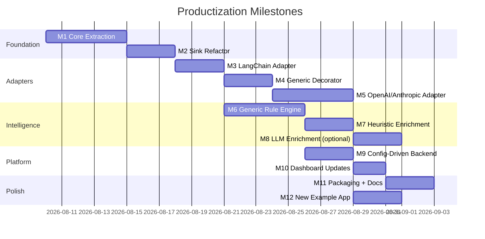

# Implementation Milestones: Standard Library

Milestone-by-milestone plan with acceptance criteria, risks, and what NOT to build yet at each stage.

---

## Overview



---

## M1: Core Extraction

**Goal:** Extract framework-agnostic core from the existing SDK. No new features -- just reorganization.

### What to Do

1. Create `ai_governance/core/` package
2. Move `sanitize()`, `fingerprint()`, `utc_now()` from `writer.py` -> `core/sanitizer.py`
3. Extract `SessionTracker` from `callback.py` -> `core/session_tracker.py`
   - The `_trace_for_run`, `_session_for_run`, `_started` dicts
   - The `_ids()`, `_session_id()`, `_duration()` methods
   - Pure Python, no LangChain imports
4. Create `EventBuilder` in `core/event_builder.py`
   - Extract `_emit()` logic from `callback.py:147-188`
   - Takes system metadata, returns event dict
5. Move validation logic from `services/evidence_api/validation.py` -> `core/validator.py`
   - Copy, don't move (evidence_api can import from core)
6. Create `core/schema.py` with event type enums and field constants
7. Update `__init__.py` exports

### Files Changed

| Action | File |
|--------|------|
| Create | `ai_governance/core/__init__.py` |
| Create | `ai_governance/core/sanitizer.py` |
| Create | `ai_governance/core/session_tracker.py` |
| Create | `ai_governance/core/event_builder.py` |
| Create | `ai_governance/core/validator.py` |
| Create | `ai_governance/core/schema.py` |
| Modify | `ai_governance/__init__.py` (update exports) |
| Modify | `ai_governance/writer.py` (import sanitizer from core) |
| Modify | `ai_governance/callback.py` (import SessionTracker from core) |

### Acceptance Criteria

- [ ] `from ai_governance.core import sanitize, fingerprint, EventBuilder, SessionTracker` works
- [ ] `sanitize()` and `fingerprint()` produce identical output to current implementation
- [ ] `SessionTracker` manages trace/span hierarchy without LangChain imports
- [ ] `EventBuilder` constructs valid governance events
- [ ] All existing tests pass (import paths may be updated with re-exports)
- [ ] `ai_governance/core/` has zero LangChain or other framework imports

### Do NOT Build

- New features
- New adapters
- New rules
- GovernanceClient class (that's M3+)

---

## M2: Sink Refactor

**Goal:** Extract sink abstraction and split current writer into discrete sink classes.

### What to Do

1. Create `ai_governance/sinks/` package
2. Define `EventSink` protocol in `sinks/base.py`
3. Extract `JsonlSink` from current `GovernanceEventWriter` -> `sinks/jsonl.py`
4. Extract `HttpSink` from current `EvidenceApiSink` -> `sinks/http.py`
5. Create `MultiSink` in `sinks/multi.py` (fan-out to multiple sinks)
6. Keep `writer.py` as backward-compat re-export (deprecated)
7. Update `callback.py` to use sink protocol

### Acceptance Criteria

- [ ] `from ai_governance.sinks import JsonlSink, HttpSink, MultiSink` works
- [ ] `JsonlSink` produces identical JSONL output to current `GovernanceEventWriter`
- [ ] `HttpSink` sends identical HTTP requests to current `EvidenceApiSink`
- [ ] `MultiSink([JsonlSink(...), HttpSink(...)])` writes to both
- [ ] Current `GovernanceEventWriter` still importable (deprecated wrapper)
- [ ] All existing tests pass

### Do NOT Build

- BatchSink (future)
- OtlpSink live streaming (future)
- Queue/retry logic (future)

---

## M3: LangChain Adapter

**Goal:** Move LangChain-specific code to an adapter. Create `GovernanceClient` as the main entry point.

### What to Do

1. Create `ai_governance/adapters/` package
2. Create `adapters/base.py` with `FrameworkAdapter` protocol
3. Move `callback.py` contents to `adapters/langchain.py`
   - `LangChainAdapter(BaseCallbackHandler)` uses `GovernanceClient` internally
   - Imports `SessionTracker` from core
4. Create `GovernanceClient` class in `ai_governance/__init__.py` or `client.py`
   - Accepts system_id, deployment_id, sinks, privacy_mode
   - Has `langchain_callback()` factory method
   - Has `emit_tool_start()`, `emit_llm_start()`, etc.
5. Make `langchain-core` optional dependency in `pyproject.toml`
6. Update `bootstrap.py` to create `GovernanceClient` instead of `Governance`
7. Keep `Governance` as backward-compat alias

### Acceptance Criteria

- [ ] `from ai_governance import GovernanceClient` works without langchain-core installed
- [ ] `gov.langchain_callback()` works when langchain-core is installed
- [ ] `gov.langchain_callback()` raises clear `ImportError` when langchain-core not installed
- [ ] Restaurant demo works with `GovernanceClient` via `gov.langchain_callback()`
- [ ] `from ai_governance import GovernanceCallback` still works (deprecated re-export)
- [ ] All existing tests pass
- [ ] `pip install ai-governance` (core only) has zero LangChain dependency

### Do NOT Build

- OpenAI/Anthropic adapters (M5)
- Generic decorator (M4)
- LLM enrichment (M8)

---

## M4: Generic Decorator Adapter

**Goal:** `@gov.tool()` decorator and `gov.trace()` context manager for any Python code.

### What to Do

1. Create `adapters/generic.py` with:
   - `@gov.tool(name, action_type, ...)` decorator
   - `gov.trace(name)` context manager
   - `TraceContext` class with `log_tool_call()` method
2. These use `GovernanceClient.emit_*` methods internally
3. No framework dependency -- pure Python

### Acceptance Criteria

- [ ] `@gov.tool(name="my_tool", action_type="write")` emits tool_start/end events
- [ ] `@gov.tool()` catches exceptions and emits tool_error
- [ ] `with gov.trace("request")` emits chain_start/end events
- [ ] Works without any AI framework installed
- [ ] Events are valid governance events (pass validation)
- [ ] Fail-open: decorator never breaks the wrapped function

### Example Test

```python
gov = GovernanceClient(system_id="test", sinks=[JsonlSink("test.jsonl")])

@gov.tool(name="search", action_type="read")
def search(query: str) -> str:
    return f"results for {query}"

search("hello")
# test.jsonl now contains tool_start and tool_end events
```

---

## M5: OpenAI and Anthropic Adapters

**Goal:** Wrap OpenAI and Anthropic clients for automatic governance capture.

### What to Do

1. Create `adapters/openai.py`:
   - Wrap `chat.completions.create()` with llm_start/end events
   - Detect tool_calls in response, emit tool_start events
   - Handle streaming (future) and non-streaming
2. Create `adapters/anthropic.py`:
   - Wrap `messages.create()` with llm_start/end events
   - Detect tool_use blocks, emit tool_start events
3. Add optional dependencies in pyproject.toml

### Acceptance Criteria

- [ ] `gov.wrap_openai(client)` returns a client that emits llm events
- [ ] `gov.wrap_anthropic(client)` returns a client that emits llm events
- [ ] Token usage captured from response objects
- [ ] Tool calls in responses produce tool_start events
- [ ] Errors produce llm_error events
- [ ] Fail-open: wrapped client works even if sink is broken
- [ ] No raw prompts or responses captured (privacy modes enforced)

### Do NOT Build

- Streaming support (future)
- LiteLLM/LlamaIndex adapters (future, based on demand)

---

## M6: Generic Rule Engine

**Goal:** Replace hardcoded rules with a pluggable, ACAP-driven rule engine.

### What to Do

1. Create `ai_governance/rules/engine.py` with `RuleEngine` class
2. Create `ai_governance/rules/builtin.py` with generic rules:
   - `WriteWithoutApproval` (current R_write_no_approval, already generic)
   - `WriteWithoutPriorCommunicate` (generic R1)
   - `ProhibitedToolUsed` (new)
   - `UnregisteredTool` (new)
   - `UnapprovedModel` (new)
   - `DuplicateWrite` (generic R3)
3. Create `rules/registry.py` for rule registration
4. Update `services/evidence_api/rules.py` to use `RuleEngine`
5. Keep legacy R1/R2/R3 as aliases for backward compat
6. Update `canonical-controls.yaml` with new rule mappings

### Acceptance Criteria

- [ ] `RuleEngine` runs all registered rules against events
- [ ] Rules use `action_type` classification, not tool names
- [ ] `WriteWithoutPriorCommunicate` flags any write without prior communicate
- [ ] `ProhibitedToolUsed` flags tools marked prohibited in ACAP
- [ ] `UnregisteredTool` flags tools not in ACAP
- [ ] Finding IDs are deterministic (same events = same ID)
- [ ] Restaurant demo finding F-06236c96da2c is still reproducible via legacy alias
- [ ] `POST /rules/run` uses RuleEngine internally
- [ ] Custom rules can be registered via `engine.register(MyRule())`
- [ ] All existing tests pass

### Do NOT Build

- Rule versioning (future)
- Rule conditions DSL (future)
- YAML-defined rules (future -- keep rules as Python classes)

---

## M7: Heuristic Enrichment

**Goal:** Auto-infer tool classifications from names, descriptions, and schemas.

### What to Do

1. Create `ai_governance/enrichment/heuristic.py`
   - `infer_action_type(tool)` -> (action_type, confidence)
   - `infer_data_classes(tool)` -> list[str]
   - `infer_side_effect(tool)` -> bool | None
   - `enrich_tool_heuristic(tool)` -> enriched tool dict
2. Create `ai_governance/enrichment/provenance.py`
   - Provenance tracking for all enrichment fields
3. Integrate into `GovernanceClient.discover()` pipeline
4. Update ACAP draft generation to use enriched tools

### Acceptance Criteria

- [ ] `infer_action_type({"name": "delete_user"})` returns `("write", 0.8+)`
- [ ] `infer_action_type({"name": "get_menu"})` returns `("read", 0.8+)`
- [ ] `infer_data_classes({"name": "process_payment"})` returns `["financial"]`
- [ ] Enriched tools carry `provenance: "heuristic"` and `needs_review: true`
- [ ] ACAP draft includes heuristic suggestions with confidence scores
- [ ] Dashboard shows enriched fields with provenance badges

---

## M8: LLM Enrichment (Optional)

**Goal:** Optional LLM-assisted classification for tool metadata.

### What to Do

1. Create `ai_governance/enrichment/llm.py`
   - `LLMEnricher` class with configurable model/provider
   - `enrich_tool(tool)` -> sends metadata to LLM, returns suggestions
   - Never sends raw prompts, user data, or runtime arguments
2. Integrate as optional step after heuristic enrichment
3. All LLM suggestions marked `provenance: "suggested_by_llm"`, `needs_review: true`

### Acceptance Criteria

- [ ] LLM enrichment is opt-in (not called unless explicitly configured)
- [ ] Only tool name, description, schema, and implementation path sent to LLM
- [ ] No raw prompts, responses, or user data sent
- [ ] All suggestions have `provenance: "suggested_by_llm"` and `needs_review: true`
- [ ] SDK works completely without LLM enrichment
- [ ] Dashboard distinguishes heuristic vs LLM suggestions

### Do NOT Build

- LLM-based rule evaluation (never)
- LLM-based finding generation (never)
- LLM-based authorization decisions (never)

---

## M9: Config-Driven Backend

**Goal:** Remove hardcoded system registry, rule mapping, and text probes from the Evidence API.

### What to Do

1. Create `services/evidence_api/system_config.yaml` replacing `SYSTEM_REGISTRY` dict
2. Create `services/evidence_api/text_probes.yaml` replacing hardcoded text probes
3. Update `app.py` to load from config
4. Update `validation.py` to load text probes from config
5. Auto-register systems that have events ingested (dynamic registry)
6. Add `GET /rules` endpoint listing available rules

### Acceptance Criteria

- [ ] Adding a new system requires only a YAML entry (or auto-registers on first event)
- [ ] Text probes are configurable without code changes
- [ ] `SYSTEM_REGISTRY` dict is gone from `app.py`
- [ ] `SYSTEM_RULES` dict is gone from `rules.py`
- [ ] `GET /rules` returns all registered rules with descriptions
- [ ] `POST /demo/reset` still works

---

## M10: Dashboard Updates

**Goal:** Remove demo-specific hardcoding from the dashboard.

### What to Do

1. Move text probes from `app.js` to server-provided config
2. Move `RULE_RECOMMENDATIONS` from `app.js` to API response (extend `GET /rules` or `GET /findings`)
3. Show provenance badges on enriched fields
4. Show "needs_review" indicators for unresolved tools

### Acceptance Criteria

- [ ] No hardcoded rule descriptions in `app.js`
- [ ] No hardcoded text probes in `app.js`
- [ ] Dashboard works for any system, not just restaurant/refund
- [ ] Provenance badges visible (heuristic, llm, human_decision)
- [ ] Unresolved tool count shown prominently

---

## M11: Packaging and Documentation

**Goal:** Make the library installable and documented for open-source.

### What to Do

1. Finalize `pyproject.toml` with correct metadata, classifiers, entry points
2. Create `docs/quickstart.md` -- 5-minute integration guide
3. Create `docs/sdk-integration.md` -- adapter-by-adapter guide
4. Create `docs/adapter-authoring.md` -- how to write a custom adapter
5. Create `docs/privacy.md` -- privacy modes, sanitization, what's captured
6. Create `docs/acap.md` -- ACAP lifecycle guide
7. Create `docs/architecture.md` -- system architecture overview
8. Add `py.typed` marker for type checking
9. Verify `pip install .` works from sdk-python/

### Acceptance Criteria

- [ ] `pip install ai-governance` installs core only
- [ ] `pip install ai-governance[langchain]` installs with LangChain support
- [ ] `pip install ai-governance[all]` installs everything
- [ ] Quickstart guide works for a fresh user in 10 minutes
- [ ] API reference covers all public classes and functions

---

## M12: New Example Application

**Goal:** Prove the library works for a non-LangChain, non-restaurant application.

### What to Do

1. Create `examples/generic-openai-wrapper/` -- a simple OpenAI chatbot with tools
2. Use `GovernanceClient` with `gov.wrap_openai()` and `@gov.tool()`
3. No LangChain dependency in this example
4. Run the example, generate evidence, load in dashboard
5. Run generic rules, generate findings if violations exist

### Acceptance Criteria

- [ ] Example works without LangChain installed
- [ ] Evidence appears in dashboard under its own system_id
- [ ] ACAP draft generates with heuristic enrichment
- [ ] Generic rules fire correctly (e.g., `R_write_no_approval`)
- [ ] Restaurant demo still works alongside the new example
- [ ] This proves the library is truly framework-agnostic

---

## Risk Tracker

| Milestone | Key Risk | Mitigation |
|-----------|----------|------------|
| M1 | Import path breakage | Keep re-exports in old locations |
| M3 | LangChain version incompatibility | Test against langchain-core 0.2 and 1.x |
| M5 | OpenAI/Anthropic API changes | Pin minimum versions, test against latest |
| M6 | Finding ID changes when rules are renamed | Keep legacy aliases |
| M7 | Heuristic false positives | Always mark `needs_review: true` |
| M8 | LLM leaking sensitive data | Only send tool metadata, never runtime data |
| M9 | Config file not found errors | Sensible defaults, clear error messages |
| M12 | New example reveals SDK gaps | Fix gaps, this is the validation milestone |
