# Smart Enrichment and ACAP Plan

How the SDK moves from raw tool discovery to a reviewed, versioned ACAP through auto-discovery, heuristic inference, optional LLM suggestions, and human review -- with full provenance tracking.

---

## The Enrichment Pipeline

```mermaid
flowchart LR
    subgraph "Stage 1: Auto-Discovery"
        D1[Inspect tools via introspection]
        D2[Extract name, description, args_schema]
        D3[Record implementation path]
    end

    subgraph "Stage 2: Heuristic Inference"
        H1[Name-based action_type guess]
        H2[Schema-based data_class guess]
        H3[Docstring keyword scan]
    end

    subgraph "Stage 3: LLM Enrichment (optional)"
        L1[Send tool metadata to LLM]
        L2[LLM suggests classifications]
        L3[Store as 'suggested_by_llm']
    end

    subgraph "Stage 4: Human Review"
        R1[Dashboard shows suggestions]
        R2[Human confirms/overrides]
        R3[Store as 'human_decision']
    end

    subgraph "Stage 5: ACAP"
        A1[Generate draft ACAP]
        A2[Apply human decisions]
        A3[Version and freeze]
    end

    D1 --> D2 --> D3 --> H1 --> H2 --> H3 --> L1 --> L2 --> L3 --> R1 --> R2 --> R3 --> A1 --> A2 --> A3
```



---

## Stage 1: Auto-Discovery

### What Exists Today

`sdk-python/ai_governance/discovery.py:discover_tools()` already handles:
- LangChain `BaseTool` objects (via `.name`, `.description`, `.args_schema`)
- Plain Python functions (via `__name__`, `__doc__`, type hints)
- Pydantic v1 and v2 schema extraction
- Implementation path via `__module__` + `__qualname__`

### What's Needed for Generic Support

```python
# Current: works with both BaseTool and functions
catalog = discover_tools([search_db, send_email, process_payment])

# Each entry produced:
{
    "name": "search_db",
    "description": "Search the customer database...",
    "description_hash": "sha256:a1b2...",
    "args_schema": {"type": "object", "properties": {"query": {"type": "string"}}},
    "implementation": "myapp.tools.search_db",
    "provenance": "discovered",

    # All classification fields start as unknown/unresolved:
    "proposed_action_type": "unknown",
    "proposed_external_side_effect": null,
    "proposed_reversible": null,
    "proposed_data_classes": [],
    "proposed_target": null,
    "authorization": "unresolved",
    "approval": {"required": null}
}
```

### New: Model and Prompt Discovery

```python
# Discover models used
model_catalog = discover_models(client)
# {"provider": "openai", "name": "gpt-4", "provenance": "discovered"}

# Fingerprint prompts (without storing content)
prompt_fingerprint = fingerprint_prompt(system_prompt)
# {"template_hash": "sha256:...", "length_chars": 1010, "content_capture": "hash"}
```

---

## Stage 2: Heuristic Inference

### Deterministic, code-based classification. No LLM.

```python
# ai_governance/enrichment/heuristic.py

WRITE_INDICATORS = {
    "name": ["create", "update", "delete", "insert", "write", "save", "confirm",
             "execute", "submit", "approve", "send", "post", "put", "patch",
             "remove", "cancel", "refund", "transfer", "pay"],
    "description": ["writes to", "creates a", "updates the", "deletes",
                     "sends a", "executes", "modifies", "stores"],
}

READ_INDICATORS = {
    "name": ["get", "fetch", "search", "query", "list", "read", "find",
             "lookup", "check", "verify", "validate", "retrieve"],
    "description": ["reads from", "retrieves", "searches", "queries",
                     "looks up", "checks", "returns"],
}

COMMUNICATE_INDICATORS = {
    "name": ["greet", "notify", "respond", "reply", "message", "email",
             "alert", "announce", "present", "propose", "suggest"],
    "description": ["sends a message", "notifies", "communicates",
                     "presents to", "proposes"],
}

SENSITIVE_DATA_INDICATORS = {
    "financial": ["payment", "refund", "charge", "price", "cost", "amount",
                  "credit", "debit", "balance", "transaction", "invoice"],
    "personal": ["name", "address", "email", "phone", "contact", "profile",
                 "user_name", "customer_name"],
    "health": ["diagnosis", "prescription", "medical", "health", "patient"],
}

SIDE_EFFECT_INDICATORS = ["send", "email", "notify", "post", "write",
                           "create", "delete", "transfer", "pay", "charge"]


def infer_action_type(tool: dict) -> tuple[str, float]:
    """Return (action_type, confidence) based on name + description heuristics."""
    name = tool.get("name", "").lower()
    desc = (tool.get("description") or "").lower()

    scores = {"read": 0, "write": 0, "communicate": 0, "execute": 0}

    for action_type, indicators in [
        ("write", WRITE_INDICATORS),
        ("read", READ_INDICATORS),
        ("communicate", COMMUNICATE_INDICATORS),
    ]:
        for keyword in indicators["name"]:
            if keyword in name:
                scores[action_type] += 2  # name match is stronger
        for phrase in indicators["description"]:
            if phrase in desc:
                scores[action_type] += 1

    best = max(scores, key=scores.get)
    total = sum(scores.values())
    confidence = scores[best] / total if total > 0 else 0

    if confidence < 0.3:
        return ("unknown", 0.0)
    return (best, round(confidence, 2))


def infer_data_classes(tool: dict) -> list[str]:
    """Infer likely data classes from tool name, description, and schema."""
    text = f"{tool.get('name', '')} {tool.get('description', '')}".lower()
    if tool.get("args_schema"):
        text += " " + json.dumps(tool["args_schema"]).lower()

    classes = []
    for data_class, keywords in SENSITIVE_DATA_INDICATORS.items():
        if any(kw in text for kw in keywords):
            classes.append(data_class)
    return classes


def infer_side_effect(tool: dict) -> bool | None:
    """Infer whether tool has external side effects."""
    text = f"{tool.get('name', '')} {tool.get('description', '')}".lower()
    if any(kw in text for kw in SIDE_EFFECT_INDICATORS):
        return True
    return None  # uncertain


def enrich_tool_heuristic(tool: dict) -> dict:
    """Apply all heuristic enrichments. Returns enriched copy."""
    enriched = dict(tool)
    action_type, confidence = infer_action_type(tool)

    if action_type != "unknown":
        enriched["proposed_action_type"] = {
            "value": action_type,
            "provenance": "heuristic",
            "confidence": confidence,
            "needs_review": confidence < 0.7,
        }

    data_classes = infer_data_classes(tool)
    if data_classes:
        enriched["proposed_data_classes"] = {
            "value": data_classes,
            "provenance": "heuristic",
            "needs_review": True,  # always review data classification
        }

    side_effect = infer_side_effect(tool)
    if side_effect is not None:
        enriched["proposed_external_side_effect"] = {
            "value": side_effect,
            "provenance": "heuristic",
            "needs_review": True,
        }

    return enriched
```

### Example Output

```
Tool: "refund_execute"
  action_type: write (confidence: 0.85, provenance: heuristic)
  data_classes: ["financial"] (provenance: heuristic, needs_review: true)
  side_effect: true (provenance: heuristic, needs_review: true)

Tool: "get_menu"
  action_type: read (confidence: 0.90, provenance: heuristic)
  data_classes: [] (no sensitive data indicators)
  side_effect: null (uncertain)
```

---

## Stage 3: LLM-Assisted Enrichment (Optional)

### Design Principles

1. **Optional** -- must work without LLM. Heuristics alone produce a usable draft.
2. **One-time** -- LLM runs at discovery/ACAP-generation time, not during runtime assessment.
3. **Never trusted** -- LLM suggestions are `provenance: "suggested_by_llm"`, never `"authorized"`.
4. **Human review required** -- every LLM suggestion marked `needs_review: true`.
5. **No raw content sent** -- only tool name, docstring, schema, and sanitized summaries.
6. **Configurable model** -- user chooses which LLM to use for enrichment.

### Implementation

```python
# ai_governance/enrichment/llm.py

from ai_governance.core import sanitize

ENRICHMENT_PROMPT = """
You are a governance analyst. Given a tool's metadata, classify it.

Tool name: {name}
Tool description: {description}
Arguments schema: {schema}
Implementation path: {implementation}

Classify this tool:
1. action_type: one of [read, write, communicate, execute, delete, approve]
2. external_side_effect: true/false/uncertain
3. data_classes: list from [financial, personal, contact, health, public, internal]
4. approval_required: true/false/uncertain
5. reversible: true/false/uncertain
6. risk_notes: brief risk assessment

Return JSON only.
"""

class LLMEnricher:
    def __init__(self, model: str = "gpt-4o-mini", provider: str = "openai"):
        self.model = model
        self.provider = provider

    def enrich_tool(self, tool: dict) -> dict:
        """Send tool metadata to LLM for classification suggestions."""
        prompt = ENRICHMENT_PROMPT.format(
            name=tool.get("name", ""),
            description=sanitize(tool.get("description", "")),
            schema=json.dumps(tool.get("args_schema", {})),
            implementation=tool.get("implementation", ""),
        )

        response = self._call_llm(prompt)
        suggestions = json.loads(response)

        enriched = dict(tool)
        for field, value in suggestions.items():
            if field == "risk_notes":
                enriched["llm_risk_notes"] = value
                continue
            enriched[f"proposed_{field}"] = {
                "value": value,
                "provenance": "suggested_by_llm",
                "model": self.model,
                "needs_review": True,  # ALWAYS
            }
        return enriched
```

### What Gets Sent to the LLM (privacy-safe)

| Sent | NOT Sent |
|------|----------|
| Tool name | Raw prompts |
| Tool description (docstring) | Runtime arguments |
| Args schema (Pydantic/JSON Schema) | Tool results |
| Implementation path (module.function) | Customer data |
| Sanitized observed usage stats | API keys |

### Provenance Tracking

Every enrichment carries provenance metadata:

```python
{
    "proposed_action_type": {
        "value": "write",
        "provenance": "suggested_by_llm",    # or "heuristic" or "human_decision"
        "model": "gpt-4o-mini",              # only for LLM
        "confidence": 0.9,                    # only for heuristic
        "needs_review": True,
        "reviewed_at": null,                  # set after human review
        "reviewed_by": null,
    }
}
```

### Provenance Hierarchy (Trust Levels)

```
human_decision  >  inferred_from_override  >  suggested_by_llm  >  heuristic  >  discovered  >  unknown
     (final)          (YAML override)          (LLM guess)       (code guess)    (raw)        (no data)
```

Only `human_decision` and `inferred_from_override` are treated as trusted for authorization decisions. All others are suggestions that require review.

---

## Stage 4: Human Review

### Dashboard Integration

The ACAP Review section in the dashboard shows each tool with:

```
┌──────────────────────────────────────────────────────────────┐
│ Tool: refund_execute                                         │
├──────────────────────────────────────────────────────────────┤
│ Action Type:    [write]     provenance: heuristic (0.85)    │
│                             LLM suggests: write (0.9)        │
│                                                              │
│ Side Effect:    [true]      provenance: heuristic            │
│ Data Classes:   [financial] provenance: suggested_by_llm     │
│ Approval Req:   [true]     provenance: suggested_by_llm     │
│ Reversible:     [false]    provenance: suggested_by_llm     │
│                                                              │
│ Authorization:  ○ allowed  ○ prohibited  ○ conditional      │
│                 ○ allowed_with_approval                      │
│                                                              │
│ Basis: [_____________________________________________]       │
│                                                              │
│ LLM Risk Note: "This tool executes financial transactions.   │
│ External side effect to payment gateway. Approval should     │
│ be required to prevent unauthorized refunds."                │
│                                                              │
│                        [Confirm] [Override] [Skip]           │
└──────────────────────────────────────────────────────────────┘
```

### Review API

```
POST /systems/{system_id}/acap/review
{
    "reviewed_by": "Alice",
    "decisions": [
        {
            "tool_name": "refund_execute",
            "authorization": "allowed_with_approval",
            "basis": "Financial impact requires human approval",
            "approval_required": true,
            "overrides": {
                "action_type": "write",
                "data_classes": ["financial", "order"]
            }
        }
    ]
}
```

### Unresolved Field Handling

Fields that are not reviewed remain `needs_review: true` and `authorization: "unresolved"`. The dashboard prominently flags:

- Total unresolved tools
- Which fields need review
- Whether LLM and heuristic agree (higher confidence) or disagree (needs attention)

The assessment status reflects unresolved tools:
- All tools reviewed -> assessment can be `satisfactory`
- Unresolved tools exist -> assessment is at best `needs_review` with a recommended action to complete ACAP review

---

## Stage 5: ACAP System

### Draft Generation

```python
# Triggered by: GET /systems/{system_id}/acap/draft
# Or: gov.generate_acap_draft()

draft = {
    "schema_version": "0.2",
    "acap_id": f"{system_id}-draft-{version}",
    "status": "draft",
    "generated_at": "2026-08-08T...",

    "system": {
        "system_id": system_id,
        "purpose": {"value": "unresolved", "provenance": "needs_human"},
        "owner": {"value": "unresolved", "provenance": "needs_human"},
    },

    "tools": [
        {
            "name": "refund_execute",
            "proposed_action_type": {"value": "write", "provenance": "heuristic"},
            "authorization": "unresolved",  # NEVER auto-authorized
            "observed_usage": {"starts": 5, "successes": 4, "errors": 1},
        },
        ...
    ],

    "review_questions": [
        {"id": "Q1", "question": "What is this system's purpose?", "target": "system.purpose"},
        {"id": "Q2", "question": "Who owns this system?", "target": "system.owner"},
        {"id": "Q3", "question": "Which tools are authorized?", "target": "tools[*].authorization"},
        ...
    ],
}
```

### Review Questions (Generic, Not Restaurant-Specific)

| ID | Question | Target | Why It Matters |
|----|----------|--------|---------------|
| Q1 | What is this AI system's intended purpose? | system.purpose | Risk classification |
| Q2 | Who is accountable for this system? | system.owner | Governance ownership |
| Q3 | Which discovered tools should be allowed to operate? | tools[*].authorization | Authorization boundary |
| Q4 | Are any actions explicitly prohibited? | prohibited_actions | Safety boundary |
| Q5 | Which tools require human approval before execution? | tools[*].approval | Human oversight |
| Q6 | What data classifications apply? | data_policy | Privacy/compliance |
| Q7 | What changes should trigger reassessment? | reassess_when | Continuous governance |

**Current problem:** `sdk-python/ai_governance/acap_draft.py` and `services/evidence_api/draft.py` have review questions that mention `confirm_order` specifically. These must be genericized.

### ACAP Versioning

```python
# Each review creates a new version
{
    "acap_id": "my-agent-v3",
    "version": 3,
    "status": "reviewed",
    "reviewed_by": "Alice",
    "reviewed_at": "2026-08-08T...",
    "previous_version": "my-agent-v2",
    "changes_since_previous": [
        "tool 'new_tool' added (discovered)",
        "refund_execute authorization changed from conditional to allowed_with_approval"
    ]
}
```

### Reassessment Triggers

The ACAP defines when it should be re-reviewed:

```yaml
reassess_when:
  - tool_added          # new tool discovered in runtime evidence
  - tool_removed        # previously seen tool no longer appears
  - model_changed       # different model name observed
  - prompt_changed      # prompt template hash changed
  - approval_logic_changed
  - external_api_changed
  - incident            # manual trigger after incident
  - schema_version_changed
```

The Evidence API can detect some of these automatically by comparing current evidence against the reviewed ACAP and flagging drift.

---

## How This Differs From Current Implementation

### Current (Demo-Specific)

1. `governance-tool-overrides.yaml` is manually written by developer
2. `acap_draft.py` has restaurant-specific review questions
3. No heuristic inference -- tools are `unknown` without overrides
4. No LLM enrichment
5. No provenance tracking on individual fields
6. ACAP versioning doesn't exist
7. Drift detection doesn't exist

### Target (Generic)

1. `GovernanceClient` auto-discovers tools at init
2. Heuristic enrichment runs automatically
3. LLM enrichment is opt-in via `gov.enrich_with_llm(model="gpt-4o-mini")`
4. Dashboard shows all suggestions with provenance
5. Human confirms via dashboard or CLI
6. ACAP versioned with change tracking
7. Evidence API detects drift (new tool, changed model, etc.)

### What NOT to Build

- **Auto-authorization** -- LLM or heuristic should never auto-authorize tools
- **Real-time LLM enrichment** -- runs at setup/discovery time only
- **Natural language policy engine** -- rules remain deterministic code
- **LLM-based finding generation** -- findings must be reproducible
