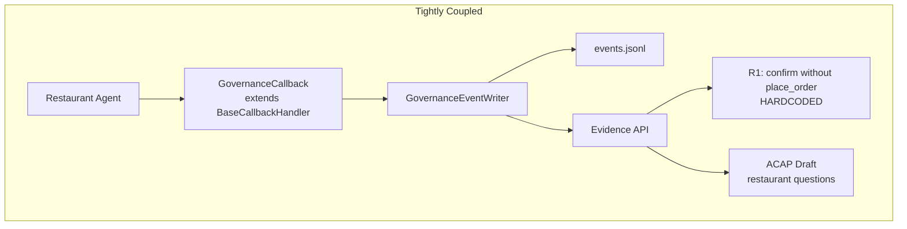
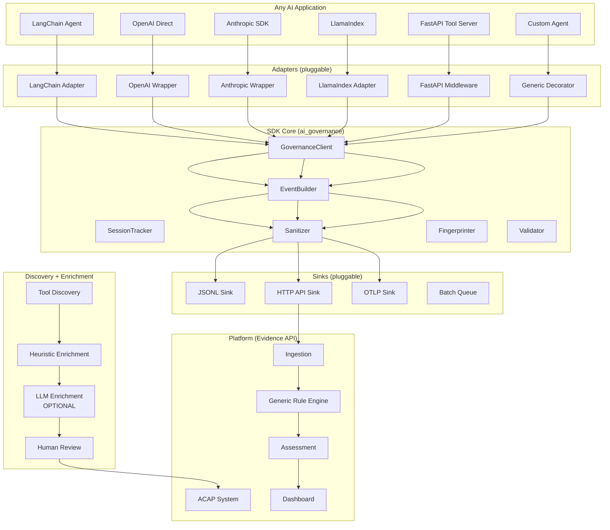

# Standard Library Productization Plan

## Executive Summary

This document is the master plan to turn the AI Governance Command Center prototype into a generic, reusable open-source library that any developer can add to any AI application with minimal configuration.

**Current state:** Working prototype tightly coupled to restaurant-agent demo and LangChain.
**Target state:** Framework-agnostic SDK with pluggable adapters, a generic rule engine, smart enrichment, and a multi-system governance dashboard.

---

## Vision: Developer Experience

### Minimal Integration (3 lines)

```python
from ai_governance import GovernanceClient

gov = GovernanceClient(
    system_id="customer-support-agent",
    deployment_id="prod-eu",
    api_endpoint="http://localhost:8000/evidence/events"
)

# LangChain
agent.invoke({"input": user_input}, config={"callbacks": [gov.langchain_callback()]})

# OpenAI direct
client = gov.wrap_openai(openai.OpenAI())
client.chat.completions.create(model="gpt-4", messages=[...])

# Any framework
with gov.trace("handle_request") as trace:
    trace.tool_call("search_db", action_type="read", args={"query": q})
    result = search_db(q)
    trace.tool_result("search_db", result=result)
```

### Tool Annotation (decorator)

```python
@gov.tool(
    name="refund_execute",
    action_type="write",
    approval_required=True,
    data_classes=["financial", "customer_data"]
)
def refund_execute(...):
    ...
```

### Zero-Config Mode

```python
gov = GovernanceClient(system_id="my-agent")
# Auto-discovers tools, infers action types, writes local JSONL
# Marks uncertain fields as needs_review
# Generates ACAP draft on first run
```

---

## What Exists Today (Audit Summary)

### Already Generic (use as-is, ~40% of code)

| File | What It Does | Why It's Generic |
|------|-------------|-----------------|
| `sdk-python/ai_governance/writer.py` | JSONL sink, sanitization, fingerprinting, HTTP export | No framework or domain references |
| `sdk-python/ai_governance/discovery.py` | Tool introspection | Works with any callable or BaseTool |
| `sdk-python/ai_governance/control_library.py` | Control loading, finding enrichment | Reads from config YAML |
| `services/evidence_api/risk.py` | Risk profiling, framework applicability, assessment builder | Data-driven from ACAP, no domain logic |
| `services/evidence_api/coverage.py` | Field coverage computation | Schema-driven, no domain references |
| `services/evidence_api/report.py` | Markdown report generation | Template-driven, no domain references |
| `services/evidence_api/validation.py` | Event schema validation | Schema-driven (except text probes) |
| `schemas/governance-event.schema.json` | Canonical event schema | Framework-agnostic JSON Schema |

### Needs Adapter Extraction (~10%)

| File | Coupling Point |
|------|---------------|
| `sdk-python/ai_governance/callback.py` | Inherits `langchain_core.callbacks.BaseCallbackHandler` |

### Needs Config Extraction (~20%)

| File | What's Hardcoded |
|------|-----------------|
| `services/evidence_api/app.py` | `SYSTEM_REGISTRY` dict with restaurant/refund paths |
| `services/evidence_api/rules.py` | `SYSTEM_RULES` dict, `ACAP_ID` string |
| `services/evidence_api/validation.py` | Text probes ("restaurant waiter bot", etc.) |
| `sdk-python/ai_governance/otel_export.py` | Same text probes |
| `services/evidence_api/static/app.js` | Same text probes, `RULE_RECOMMENDATIONS` |
| `sdk-python/ai_governance/bootstrap.py` | Default system_id, agent_id, tracked packages |
| `services/evidence_api/draft.py` | `TOOL_FIELD_NOTES`, review questions |

### Demo-Specific (move to examples/, ~30%)

| File | Why It's Demo-Specific |
|------|----------------------|
| `sdk-python/ai_governance/findings.py` | R1/R2/R3 check for `place_order`/`confirm_order` by name |
| `sdk-python/ai_governance/acap_draft.py` | Review questions mention restaurant domain |
| `sdk-python/ai_governance/scenario_runner.py` | Hardcoded scenarios with test users |
| `sdk-python/ai_governance/coverage_report.py` | Test user names in probes |
| `examples/restaurant-agent/Restaurant_agent1.py` | The demo agent itself |
| `examples/refund-agent/generate_evidence.py` | Synthetic event generator |

---

## Architecture: Before vs After

### Before (Current)



### After (Target)



---

## Ten Architecture Layers

### Layer 1: Core SDK
Event model, schema validation, sanitizer, fingerprinter, session/trace/span management, privacy modes, error handling, fail-open behavior.

**Source:** Already exists in `writer.py`, `validation.py`, `governance-event.schema.json`. Needs extraction into `core/` subpackage.

### Layer 2: Framework Adapters
LangChain callback, OpenAI client wrapper, Anthropic client wrapper, LiteLLM adapter, LlamaIndex adapter, Semantic Kernel adapter, generic Python decorator, FastAPI middleware, raw JSON log adapter, OpenTelemetry adapter.

**Source:** Only LangChain exists today (`callback.py`). All others are new.

### Layer 3: Sink/Export System
Local JSONL sink, HTTP API sink, OTLP sink, batch/retry queue, fail-open behavior, privacy-safe payload enforcement.

**Source:** JSONL and HTTP sinks exist (`writer.py`). OTLP exists as offline batch (`otel_export.py`). Batch queue is new.

### Layer 4: Discovery System
Discover tools, models, prompt hashes, framework versions, tool schemas/docstrings. Generate tool catalog and ACAP draft.

**Source:** `discovery.py` exists. Needs generalization for non-LangChain tools.

### Layer 5: Enrichment System
Deterministic heuristics, optional LLM-assisted suggestions, human override/review, provenance tracking, unresolved fields.

**Source:** Heuristic enrichment exists implicitly in `acap_draft.py`. LLM enrichment is new.

### Layer 6: ACAP System
Draft generation, review workflow, versioning, allowed/prohibited/conditional actions, approval boundaries, reassessment triggers.

**Source:** `acap_draft.py`, `acap_review.py` exist. Versioning is new.

### Layer 7: Rule Engine
Generic deterministic rules, rule versioning, finding ID determinism, event evidence citations. No domain-specific tool names.

**Source:** `findings.py` and `rules.py` exist but are restaurant-specific. Need generalization.

### Layer 8: Control Library
Canonical controls, framework mappings, no legal overclaiming, framework applicability separate from mapping.

**Source:** `canonical-controls.yaml` and `control_library.py` exist and are generic.

### Layer 9: Backend Platform
Evidence API, system registry, ACAP endpoints, coverage, findings, assessment, live ingestion, assessment freshness, future auth/multi-tenancy.

**Source:** `services/evidence_api/` exists and is mostly generic. Registry needs config-driven approach.

### Layer 10: Dashboard
System selector, live evidence status, ACAP review, coverage, findings, controls, framework mappings, assessment, stale warning, export.

**Source:** `static/app.js` exists and is mostly generic. Needs text probe extraction.

---

## What NOT to Build Yet

| Do Not Build | Why |
|-------------|-----|
| TypeScript SDK | Python first, validate the interface |
| React/Vue dashboard rewrite | Current vanilla JS works; rewrite after API stabilizes |
| PostgreSQL/Redis/Kafka backend | SQLite sufficient until proven otherwise |
| Multi-tenancy/auth | Single-user sufficient for open-source v1 |
| Full EU AI Act compliance engine | Legal review required; keep "potential relevance" framing |
| CrewAI/AutoGen adapters | Wait for community demand |
| CI/CD pipeline for library | After first stable release |
| Hosted SaaS version | After open-source adoption validated |

---

## Risks and Mitigations

| Risk | Impact | Mitigation |
|------|--------|------------|
| Breaking current demo | Can't validate changes | Keep demo as integration test |
| Adapter interface too rigid | Can't support new frameworks | Use Protocol (structural typing), not ABC |
| LLM enrichment becomes trusted | False authorization | Enforce provenance tracking; LLM = "suggested", never "authorized" |
| Over-engineering adapters | Slow delivery | Ship LangChain + generic decorator first, add others based on demand |
| Event schema changes break clients | Migration pain | Version schema explicitly; keep v0.1 backward-compatible |
| JSONL files become very large | Performance degradation | Add rotation/archival (future); keep current append-only model |

---

## Success Criteria

The productization is successful when:

1. A developer can `pip install ai-governance` and instrument a non-LangChain app in <10 minutes
2. The dashboard shows governance data for that app without code changes to the dashboard
3. Generic rules fire on action-type classifications, not tool names
4. ACAP draft is generated automatically with `needs_review` fields
5. All current restaurant/refund demo tests still pass
6. At least one new example (e.g., generic OpenAI wrapper) works end-to-end
