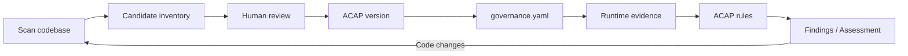

# AgentGov: Product and Workflow

## What is AgentGov?

AgentGov is a runtime AI governance SDK and evidence platform that lets teams discover, approve, observe, and audit the capabilities of their AI-powered backends.

## Problem

AI agents and LLM-powered applications call tools, make decisions, and take actions. Today there is no lightweight way to:

- Know what capabilities an AI backend actually has.
- Get a human to approve which actions it is allowed to take.
- Prove at runtime that the agent stayed within those boundaries.
- Detect when a code change introduces new, unapproved capabilities.

Compliance frameworks (EU AI Act, NIST AI RMF, ISO 42001) require evidence of governance, but most teams have no tooling to produce it.

## Target Users

- **Engineering leads** building AI-powered backends who need governance without slowing delivery.
- **Compliance / risk teams** who need auditable evidence of what AI systems do.
- **Founders / CTOs** who want to demonstrate responsible AI practices to customers and regulators.

## Core Principle

> **Scanner suggests. Human approves. Runtime proves. Rescan shows drift.**

The scanner never decides policy. It proposes candidates. A human reviews each one. The runtime observes actual behavior against the approved policy. When code changes, a rescan highlights what is new, changed, or removed.

## User Journey

### 1. Install the SDK

```
pip install agent-governance-sdk
```

### 2. Scan the backend codebase

```
agent-governance scan .
```

The scanner walks Python source files using AST analysis (no AI/LLM calls). It detects functions that reach dangerous sinks (payments, email, databases, HTTP, filesystem, subprocess, cloud APIs) and outputs candidate capabilities with risk levels and confidence scores.

### 3. Upload discovery to the platform

```
agent-governance upload-discovery governance-discovery.json --api http://127.0.0.1:8000
```

This sends the candidate list to the Evidence API. The system is auto-registered if it does not exist yet. No source code is uploaded — only the capability metadata.

### 4. Review candidates in the dashboard

Open the dashboard and select the system. Each candidate shows its name, risk level, confidence, and scanner evidence. For every candidate, the reviewer chooses one of:

| Decision | Meaning |
|----------|---------|
| **Approve** | This is a real capability; include it in the ACAP. |
| **Edit** | This is a real capability but the metadata needs correction. |
| **Reject** | This is a real capability but we do not want it active. |
| **Not a capability** | False positive; exclude from future consideration. |

Every review decision is logged with reviewer identity and timestamp.

### 5. Generate an immutable ACAP version

Once candidates are reviewed, the platform generates an **Approved Capability Access Policy (ACAP)** — a versioned, immutable snapshot of what the system is allowed to do. ACAP versions are never edited in place; a new version is created each time.

### 6. Download governance.yaml

The platform exports a `governance.yaml` manifest listing approved capabilities with their module paths, action types, and approval requirements.

### 7. Instrument the backend

```python
from ai_governance import GovernanceClient

gov = GovernanceClient.from_config("governance.yaml")
gov.instrument_from_config()
```

This dynamically wraps approved functions so they emit governance events at runtime. Adapters are also available for OpenAI, Anthropic, FastAPI, and LangChain.

### 8. Collect runtime evidence

As the backend runs, the SDK emits structured events (tool starts, tool ends, errors, model calls) to a local JSONL file and/or the Evidence API over HTTP. Events include trace IDs, timestamps, sanitized arguments, and durations — but never raw prompts or responses by default.

### 9. Run ACAP rules

The platform compares observed runtime behavior against the latest ACAP version:

- Was a tool used that is not in the ACAP? (**unapproved observed**)
- Was a tool used that was explicitly denied? (**denied observed**)
- Was approval required but not verified? (**approval required missing**)
- Did runtime data classes exceed the approved boundary? (**data class mismatch**)

Rules are observation-only. They generate findings but do not block or enforce.

### 10. Review findings and assessment

The dashboard shows findings linked to exact event IDs, mapped to compliance frameworks (NIST AI RMF, EU AI Act, ISO 42001). An assessment summarizes governance status, risk profile, and recommended actions.

### Rescan for drift

When the codebase changes, re-run the scanner and upload. The platform compares the new discovery against the previous one and flags new, changed, or removed capabilities that need re-review.

## What the Dashboard Shows

| Tab | Purpose |
|-----|---------|
| **Overview** | KPI strip: governance status, risk level, event count, findings, failed controls, confidence |
| **Discovery** | Scanner results, candidate cards, review actions, changeset tracking |
| **ACAP** | Approved/denied capabilities, version history, manifest export |
| **Evidence** | Field coverage analysis across collected events |
| **Findings** | Rule violations with severity, framework mappings, event timelines |
| **Assessment** | Overall governance status, risk profile, framework applicability |
| **Settings** | Demo reset, run assessment, export report |

## Governance Loop Diagram



## What Is Implemented

- Python SDK (`agent-governance-sdk`) with GovernanceClient, `@gov.tool` decorator, trace context
- Adapters: OpenAI, Anthropic, FastAPI middleware, LangChain callback
- JSONL and HTTP event sinks
- Local deterministic codebase scanner (AST-based, 90+ sink patterns)
- CLI: `agent-governance scan` and `agent-governance upload-discovery`
- Evidence API (FastAPI + SQLite)
- Dashboard with capability review, ACAP generation, findings, assessment
- Immutable ACAP versions with review provenance
- governance.yaml generation and manifest-based instrumentation
- Runtime-vs-ACAP rules (4 rules)
- Audit freshness tracking
- Rescan changeset/drift detection
- Product website at `/product/`
- 9 example apps and a full governance loop demo script
- 239 tests across 14 test files

## What Is Not Yet Implemented

- AI/LLM-assisted scanning (current scanner is purely deterministic AST analysis)
- Runtime blocking or enforcement (rules are observation-only)
- Multi-user authentication or role-based access
- Production database (currently SQLite)
- Webhook or notification integrations
- CI/CD pipeline integration
- OTLP/OpenTelemetry export (stub exists, not production-ready)
- Multi-language SDK support (Python only)

## Non-Technical Explanation

Think of AgentGov like a building permit system for AI capabilities. Before an AI agent can "do things" — send emails, process refunds, delete records — someone has to review what it is capable of and approve or deny each action. Once approved, the system watches what the agent actually does at runtime and flags anything that was not approved or that violates the agreed boundaries. If the code changes, the system re-scans and asks for re-approval of anything new. The result is an auditable trail showing what was approved, what happened, and whether the two matched.

## Important Caveats

- The scanner is **local and deterministic**. It uses Python AST analysis. No AI or LLM is called during scanning.
- **No source code is uploaded** to the platform. Only capability metadata is sent.
- Runtime rules are **observation-only**. They detect and report but do not block or prevent actions.
- `approval.granted` alone is **not trusted** by ACAP rules. Rules require `approval.verified` or `approval.trusted` to consider approval valid.
- ACAP versions are **immutable**. Changes produce a new version; old versions are preserved.
