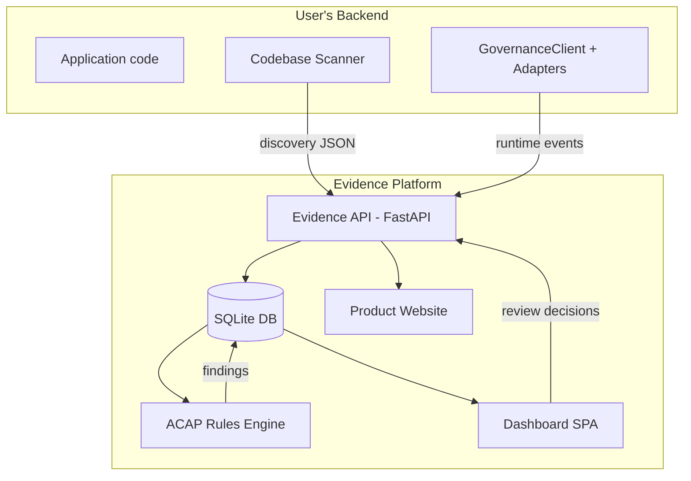
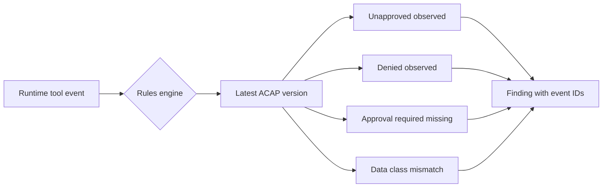
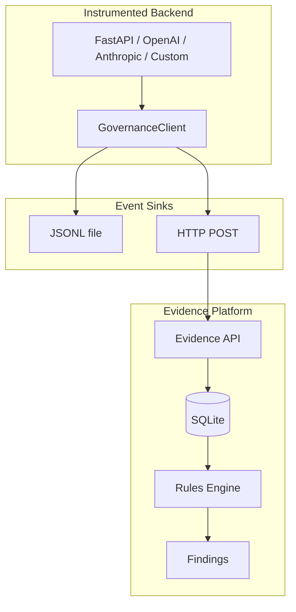

# AgentGov: Architecture and Codebase

## High-Level Architecture



The system has two main parts: the **SDK** (installed in the user's backend) and the **Evidence Platform** (a standalone FastAPI service with a web dashboard).

## SDK Architecture

The SDK (`agent-governance-sdk`) is a framework-neutral Python package with no required dependencies.

### GovernanceClient

The central class. Created from a `governance.yaml` manifest or configured directly.

**Key methods:**

| Method | Purpose |
|--------|---------|
| `GovernanceClient.from_config(path)` | Load client from governance.yaml |
| `gov.instrument_from_config()` | Dynamically wrap approved functions from manifest |
| `gov.tool()` | Decorator to wrap a function for governance event emission |
| `gov.trace(name)` | Context manager for grouping operations under a trace |
| `gov.request_context()` | Context manager for HTTP request lifecycle tracking |
| `gov.emit(event)` | Low-level event emission |

**Design choices:**
- Fail-open: instrumentation errors are swallowed, never crash the app.
- Context propagation via Python `ContextVar` for trace/span parenting.
- Sanitizes arguments and results before emission; fingerprints sensitive values.
- Tracks execution time per session via `SessionTracker`.

### Adapters

Located in `sdk-python/ai_governance/adapters/`. Each adapter wraps a specific framework to emit governance events transparently.

| Adapter | File | What it wraps |
|---------|------|---------------|
| OpenAI | `openai.py` | `openai.ChatCompletion.create` and similar |
| Anthropic | `anthropic.py` | `anthropic.Anthropic().messages.create` and similar |
| FastAPI | `fastapi.py` | ASGI middleware for request/response tracking |
| LangChain | `langchain.py` | `BaseCallbackHandler` for chain/LLM/tool/retriever events |
| Base | `base.py` | Common adapter utilities |
| LLM Common | `llm_common.py` | Shared logic for LLM adapters |

### Sinks

Located in `sdk-python/ai_governance/sinks/`. Events flow through sinks to storage.

| Sink | File | Behavior |
|------|------|----------|
| JsonlSink | `jsonl.py` | Append-only local JSONL file, thread-safe, optional HTTP forwarding |
| HttpSink | `http.py` | Best-effort POST to Evidence API (0.5s timeout, fire-and-forget) |
| EventSink | `base.py` | Protocol: `emit()`, `flush()`, `close()` |

### LangChain Callback

`sdk-python/ai_governance/callback.py` — `GovernanceCallback` extends `BaseCallbackHandler`. Captures chain, LLM, chat model, tool, retriever, and agent events. Never persists raw prompts; uses fingerprinting and sanitization.

### Manifest Instrumentation

`sdk-python/ai_governance/manifest.py` — Parses `governance.yaml`, resolves module paths to live functions, wraps them with `@gov.tool()`, and replaces them in the module namespace. Only wraps functions with status `approved`, `approved_for_acap`, or `edited`. Uses a `__ai_governance_wrapped__` marker to prevent double-wrapping.

## Scanner Architecture

Located in `sdk-python/ai_governance/scanner/`. The scanner is **local and deterministic** — it uses Python AST analysis and pattern matching. No AI or LLM is involved.

### How It Works

```
scan_codebase(root)
  ├─ Walk all .py files (skip venv, .git, __pycache__)
  ├─ Parse each file with Python AST
  ├─ Visit function definitions
  │   ├─ Resolve call chains through imports and local bindings
  │   ├─ Match against sink catalog (90+ patterns)
  │   ├─ Detect @gov.tool decorators
  │   └─ Detect FastAPI route decorators
  ├─ Classify each candidate (action_type, risk, confidence)
  └─ Output governance-discovery.json
```

### Scanner Modules

| File | Purpose |
|------|---------|
| `ast_scanner.py` | AST visitor, walks files, resolves calls, detects sinks/decorators/routes |
| `sinks.py` | Sink catalog: 90+ patterns (Stripe, SMTP, DB, HTTP, filesystem, subprocess, cloud) + model usage patterns |
| `rules.py` | Classification engine: action_type, risk (HIGH/MEDIUM/LOW), confidence, approval_required |
| `models.py` | Data builders: `build_candidate()`, `build_evidence()`, `build_scan_summary()` |
| `output.py` | Formats and writes governance-discovery.json |

### Confidence Signals (highest to lowest)

| Signal | Confidence | Example |
|--------|-----------|---------|
| sink_reachability | 0.90 | Function calls `stripe.charges.create` |
| existing_decorator | 0.85 | Function has `@gov.tool(...)` |
| route_and_name | 0.70 | FastAPI route + risky function name |
| name_heuristic | 0.50 | Function named `delete_customer` |

### Output

`governance-discovery.json` contains: schema version, scanner version, scan summary (files/functions/risk counts), candidate list (each with capability_id, evidence chain, classification), and model surface (LLM API calls found).

## Evidence API Architecture

Located in `services/evidence_api/`. A FastAPI application backed by SQLite.

### Database Schema

| Table | Key Columns | Purpose |
|-------|-------------|---------|
| `events` | event_id, system_id, trace_id, event_type, tool_name, payload_json | Runtime governance events |
| `capabilities` | capability_id, system_id, name, module_path, risk, review_status | Scanner-discovered capabilities |
| `capability_reviews` | review_id, capability_id, decision, reviewer, edited_values_json | Audit trail of human decisions |
| `discovery_uploads` | upload_id, system_id, scanner_version, candidates_count | Scanner upload history |
| `acap_versions` | acap_version_id, system_id, version_number, payload_json | Immutable ACAP snapshots |
| `acap_reviews` | system_id, tool_name, field, value, basis | Legacy tool-level review decisions |
| `findings` | finding_id, rule_id, system_id, severity, event_ids_json | Rule violation records |
| `assessments` | assessment_id, system_id, overall_status, payload_json | Governance assessment snapshots |

### Key API Endpoints

**Discovery & Review:**
- `POST /discovery/upload` — Upload scanner results
- `GET /systems/{id}/discovery` — Get latest discovery with changeset
- `POST /systems/{id}/capabilities/{cap_id}/approve` — Approve a capability
- `POST /systems/{id}/capabilities/{cap_id}/reject` — Reject
- `POST /systems/{id}/capabilities/{cap_id}/edit` — Edit metadata
- `POST /systems/{id}/capabilities/{cap_id}/not-a-capability` — Mark false positive

**ACAP:**
- `POST /systems/{id}/acap/generate-from-discovery` — Generate ACAP from reviewed capabilities
- `GET /systems/{id}/acap/versions` — List immutable ACAP versions
- `GET /systems/{id}/governance-manifest.yaml` — Export governance.yaml

**Evidence & Rules:**
- `POST /evidence/events` — Ingest runtime events (single or batch)
- `POST /systems/{id}/rules/run-acap` — Run ACAP comparison rules
- `GET /findings` — List findings, optionally filtered by system

**Assessment:**
- `POST /systems/{id}/assessments/run` — Run governance assessment
- `GET /systems/{id}/assessment-report.md` — Export markdown report

## Dashboard Architecture

Located in `services/evidence_api/static/`. A single-page app (vanilla JS, no build step) served by FastAPI at `/ui/`.

### Tabs

1. **Overview** — KPI strip: governance status, risk level, event count, findings, failed controls, confidence.
2. **Discovery** — Upload discovery JSON, view candidates as cards, filter by risk/status, approve/reject/edit, view model surface and changeset.
3. **ACAP** — Preview approved/denied capabilities, browse version history, run ACAP rules, export manifest.
4. **Evidence** — Field coverage table showing capture status per evidence field.
5. **Findings** — Split-pane: findings list + detail panel with description, framework mappings, recommendations, event timeline.
6. **Assessment** — Governance status badge, risk profile, framework applicability, recommended actions.
7. **Settings** — Demo reset, run assessment, export report.

### Product Website

Located in `services/evidence_api/product/`. A separate static site served at `/product/` that explains the product externally.

## ACAP and Rules Architecture

### ACAP Versions

Each ACAP version is an immutable JSON snapshot containing:
- `allowed_capabilities` — Tools the human approved, with action types and approval requirements.
- `denied_capabilities` — Tools the human explicitly rejected.
- Version number, timestamp, and system_id.

New reviews produce a new version. Old versions are never modified.

### Runtime Rules



| Rule | Severity | What it checks |
|------|----------|----------------|
| `R_ACAP_unapproved_observed` | medium | Tool used at runtime but not in ACAP |
| `R_ACAP_denied_observed` | high | Tool used at runtime but explicitly denied in ACAP |
| `R_ACAP_approval_required_missing` | high | Tool requires approval but no verified/trusted approval present |
| `R_ACAP_data_class_mismatch` | medium | Runtime data classes exceed ACAP-approved boundary |

**Important:** `approval.granted` alone is not trusted. Rules require `approval.verified`, `approval.trusted`, or `approval.token_verified`.

### Pre-ACAP Rules

Two legacy rules exist for demo systems without ACAP:
- `R1_confirm_without_proposal` — Order confirmed without prior proposal (restaurant-agent).
- `R_write_no_approval` — Write action without approval (refund-agent).

## Runtime Evidence Flow



## Folder-by-Folder Codebase Guide

```
Restaurant_Agent/
├── sdk-python/                    # Published SDK package
│   ├── ai_governance/
│   │   ├── client.py              # GovernanceClient core
│   │   ├── callback.py            # LangChain callback handler
│   │   ├── manifest.py            # governance.yaml parser + runtime wrapper
│   │   ├── writer.py              # Sink aliases and utilities
│   │   ├── cli.py                 # CLI entry point (scan, upload-discovery)
│   │   ├── otel_export.py         # OpenTelemetry export stub
│   │   ├── control_library.py     # Control framework mappings
│   │   ├── adapters/              # Framework-specific adapters
│   │   │   ├── openai.py
│   │   │   ├── anthropic.py
│   │   │   ├── fastapi.py
│   │   │   ├── langchain.py
│   │   │   └── llm_common.py
│   │   ├── scanner/               # Deterministic codebase scanner
│   │   │   ├── ast_scanner.py     # AST visitor and call resolver
│   │   │   ├── sinks.py           # 90+ sink patterns + model patterns
│   │   │   ├── rules.py           # Classification engine
│   │   │   ├── models.py          # Data structure builders
│   │   │   └── output.py          # Discovery JSON formatter
│   │   ├── sinks/                 # Event sink implementations
│   │   │   ├── jsonl.py           # Local JSONL writer
│   │   │   ├── http.py            # HTTP POST sink
│   │   │   └── base.py            # EventSink protocol
│   │   ├── core/                  # Shared utilities
│   │   │   └── validation.py      # Event validation, sanitization
│   │   ├── privacy/               # Privacy and redaction logic
│   │   └── discovery/             # Tool discovery utilities
│   └── pyproject.toml             # Package config, CLI entry points
│
├── services/evidence_api/         # Evidence platform backend
│   ├── app.py                     # FastAPI routes (all endpoints)
│   ├── db.py                      # SQLite schema and queries
│   ├── rules.py                   # Runtime + ACAP rules engine
│   ├── validation.py              # Event validation (re-exports from SDK)
│   ├── evidence.db                # SQLite database file
│   ├── static/                    # Dashboard SPA
│   │   ├── index.html
│   │   ├── app.js
│   │   └── styles.css
│   └── product/                   # Product website
│       ├── index.html
│       ├── app.js
│       └── styles.css
│
├── examples/                      # 9 example applications
│   ├── restaurant-agent/          # Indian restaurant ordering agent
│   ├── refund-agent/              # Customer refund with approval
│   ├── openai-direct/             # Direct OpenAI wrapper
│   ├── anthropic-direct/          # Direct Anthropic wrapper
│   ├── fastapi-app/               # FastAPI middleware example
│   ├── custom-python-tool/        # Custom function instrumentation
│   ├── manifest-instrumentation/  # Manifest-first instrumentation
│   ├── scanner-demo-app/          # Minimal app for scanner demo
│   └── demo-data/                 # Fixture JSONL and ACAP data
│
├── scripts/
│   ├── run_full_governance_loop_demo.py   # End-to-end governance demo
│   └── run_demo_reset.py                 # Load demo systems into DB
│
├── tests/                         # 239 tests across 14 files
│   ├── test_evidence_api.py       # 99 tests — API endpoints, ACAP, rules
│   ├── test_codebase_scanner.py   # 51 tests — scanner detection logic
│   ├── test_governance_probe.py   # 21 tests — probe/event collection
│   ├── test_manifest_instrumentation.py  # 18 tests — manifest + wrapping
│   ├── test_findings.py           # 10 tests — finding creation
│   ├── test_custom_function_adapter.py   # 8 tests
│   ├── test_anthropic_adapter.py  # 7 tests
│   ├── test_openai_adapter.py     # 6 tests
│   ├── test_otel_export.py        # 6 tests
│   ├── test_fastapi_adapter.py    # 5 tests
│   ├── test_demo_data.py          # 4 tests
│   ├── test_evidence_ui.py        # 2 tests
│   ├── test_full_loop_demo.py     # 1 test — end-to-end smoke
│   └── test_sdk_layout.py         # 1 test — package structure
│
├── schemas/                       # governance-event.schema.json
├── control-library/               # canonical-controls.yaml
├── governance_probe/              # Legacy probe module
├── docs/                          # Architecture docs and reports
│   ├── adr/                       # Architecture decision records
│   └── generated/                 # Auto-generated reports
└── CLAUDE.md                      # Project instructions
```
